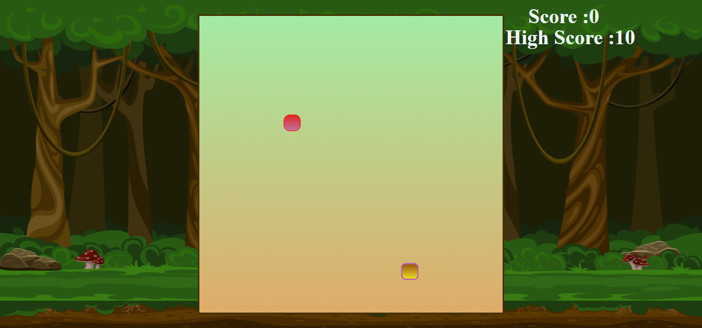
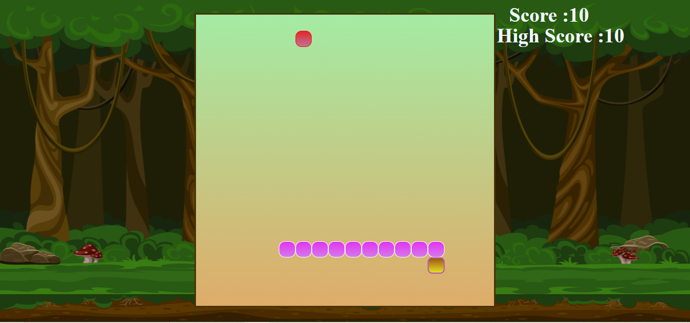

# Snake Game Web App
Welcome to the **Snake Game Web App**! This classic arcade-style game lets you control a snake as it moves around the screen, eating food to grow longer. Be careful not to run into the walls or the snake's own body!

## Features
**Real-Time Score:** The game tracks the player's score in real-time as the snake eats food.
**High Score:** The highest score achieved during a session is saved, allowing players to compete against their own best score.
**Responsive Design:** The game works seamlessly on both desktop and mobile devices.
**Smooth Controls:** Use the arrow keys or swipe gestures (on mobile) to control the snake’s direction.
## How to Play
1. **Start the Game:** Once the game loads, press the **Start** button to begin.
2. **Control the Snake:** Use the arrow keys (or swipe gestures on mobile) to move the snake in the desired direction.
3. **Eat the Food:** The snake grows longer each time it eats food, and the score increases accordingly.
4. **Avoid Collisions:** The game ends if the snake collides with the walls or its own body.
5. **Track Your Score:** The real-time score is displayed on the screen. After each game, the **High Score** is updated if you’ve set a new record.

## Demo
###Home Page

###Game Page
    
